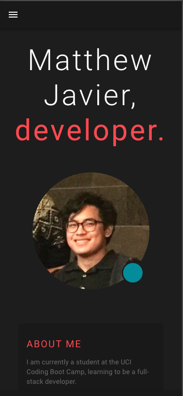
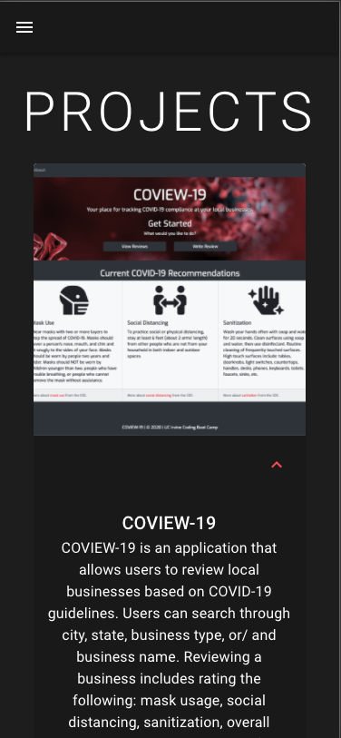
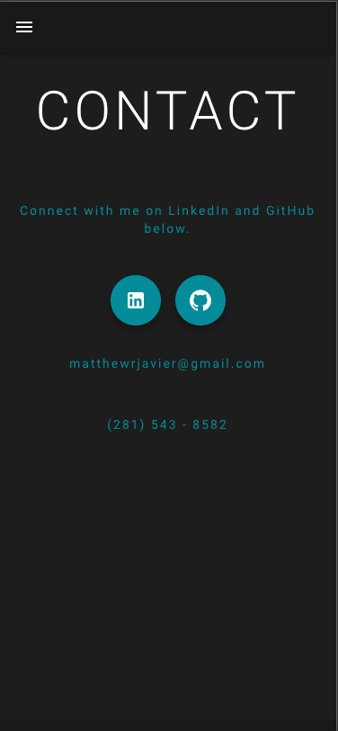

# React Portfolio

This is my new portfolio made using React. It was developed using the Material-UI framework.

It contains a Home/About page, a Projects page, and a Contact page. Each page is created using a variety of Material-UI and self-defined components.

Visit [here](https://mattjavier.github.io/react-portfolio/) to view the portfolio.

## Demo Walkthrough

## Images

* The home/about page

* The project page

* The contact page

